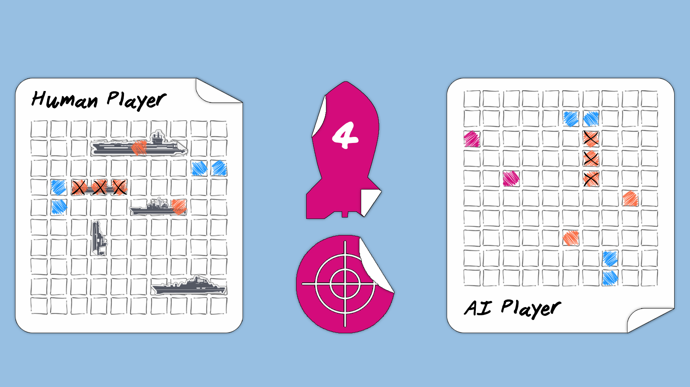
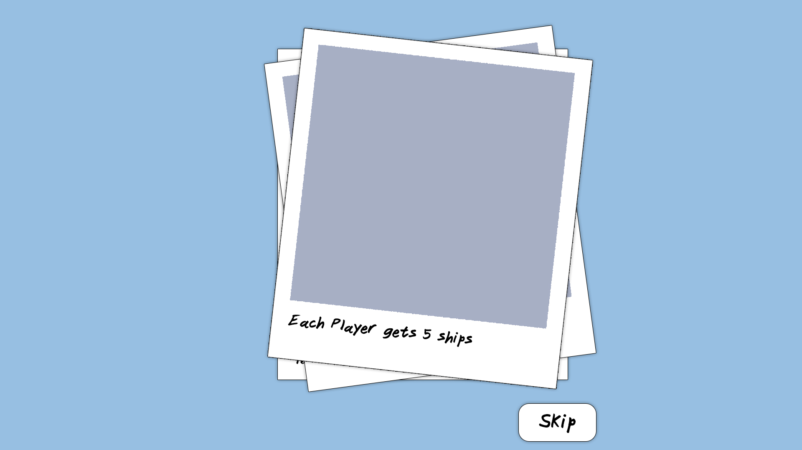
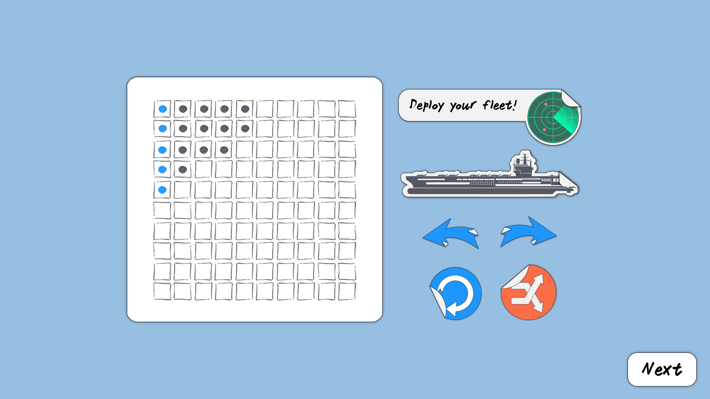
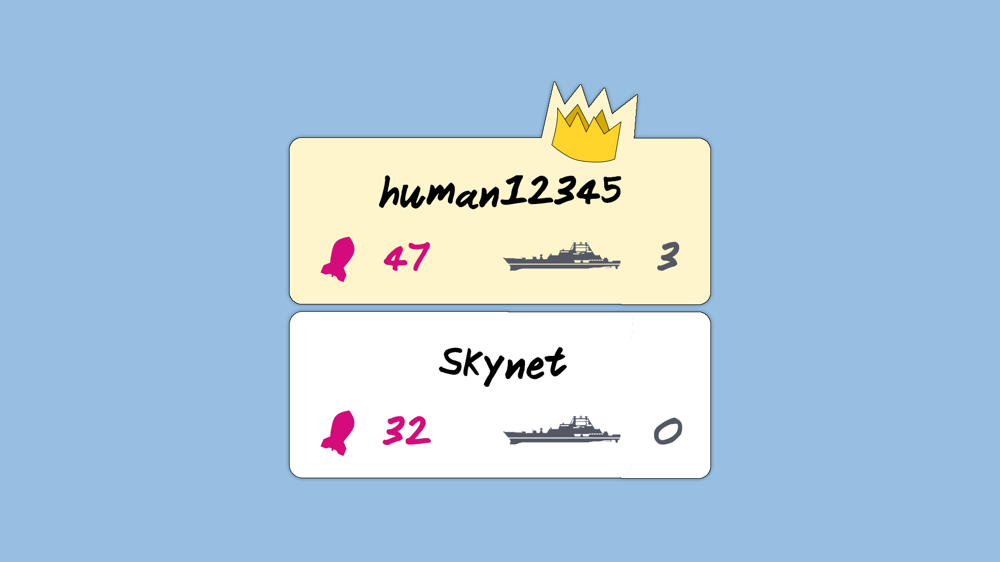

# Battleship Classic v1.0.4

Battleship is a two-player guessing board game. Each player tries to guess the location of their opponent's fleet by firing shots at their opponent's 10 x 10 square grid.
Battleship Classic uses the original board game's rules.
This game only supports Human vs. AI mode.

## Contents

1. [**Game Rules**](#Game-Rules)
2. [**UI Design**](#UI-Design)
3. [**Code Documentation**](#Code-Documentation)

## Game Rules

### Chapter Contents

1. [**Steup**](#Setup)
2. [**Gameplay**](#Gameplay)

### Setup

* The game can be played with **only two players**; a human against an AI opponent.
* The game offers an "Advanced Mode" option, it **does not** affect the AI's difficulty, but simply offers a more challenging play style (more details below).
* Each player gets a fleet of **five battleships** with varying lengths:
    1. An aircraft carrier (5 squares)
    2. A battleship (4 Squares)
    3. A submarine (3 Squares)
    4. A cruiser (3 squares)
    5. A destroyer (2 squares)
* Each player places their ships on a **10 by 10** square grid. Ships can placed anywhere on the grid, but they cannot:
    1. Overlap
    2. Bend
    3. Be placed diagonally
    4. Extend outside the grid's edges
* Ships can be placed in close proximity (no empty squares between them).
* Each player **does not know** the location of their opponent's ships.

### Gameplay

* A **random** player is selected to take the first turn.
* Each player must mark **any empty square** on their opponent's grid.
* The number of shots allowed for each player per turn **changes when advanced mode is enabled**.
* When advanced mode is enabled, each player is allowed **six shots** per turn. However, this number **is reduced** for each destroyed ship of their own fleet:
    1. Air craft carrier (minus 2 shots)
    2. Battleship (minus 1 shot)
    3. Cruiser (minus 1 shot)
    4. Submarine (minus 1 shot)
    5. Destroyer (minus 1 shot)
* Each player must place **all available shots** in their turn (i.e cannot place 3 shots when they have 5 allowed).
* The player who destroys their opponents fleet first, wins.

## UI Design

### Chapter Contents

1. [**Color Palette**](#color-palette)
2. [**Fonts**](#fonts)
2. [**Mockups**](#mockups)

### Color Palette

*  #97bfe2
*  #d30c7b
*  #1e96fc
*  #f96e46
*  #545863
*  #f2f2f2
*  #000000

### Fonts

* Janitor Font [Visit font's source](https://www.1001fonts.com/janitor-font.html)

### Mockups

1. **Game Interface:** An ongoing game.

    

2. **Tutorial:** A quick introduction to the game's rules.

    

3. **Fleet Editor:** Where the player can place their ships.

    

4. **Game Settings Controls:** Receives input from the player needed to start a new game.

    

5. **Gameover dialog:** Displays game stats and the winner.

    

## Code Documentation