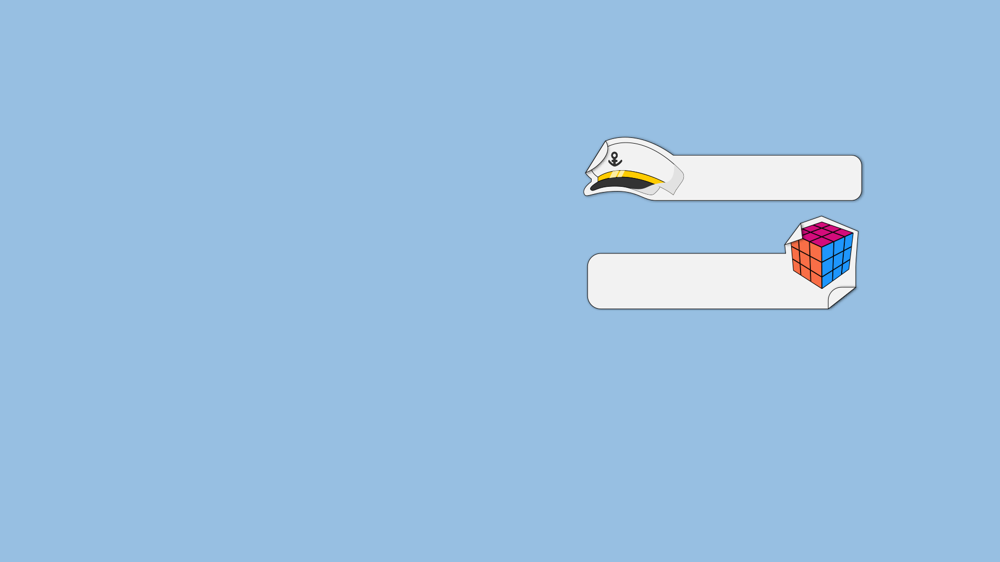

# Battleship Classic v1.0.4

Battleship is a two-player guessing board game. Each player tries to guess the location of their opponent's fleet by firing shots at their opponent's 10 x 10 square grid.
Battleship Classic uses the original board game's rules.
This game only supports Human vs. AI mode.

## Contents

1. [**Game Rules**](#Game-Rules)
2. [**UI Design**](#UI-Design)
3. [**Abstract Structure**](#abstract-structure)
4. [**Code Documentation**](#Code-Documentation)

## Game Rules

### Chapter Contents

1. [**Steup**](#Setup)
2. [**Gameplay**](#Gameplay)

### Setup

* The game can be played with **only two players**; a human against an AI opponent.
* The game offers an "Advanced Mode" option, it **does not** affect the AI's difficulty, but simply offers a more challenging play style (more details below).
* Each player gets a fleet of **five battleships** with varying lengths:
    1. An aircraft carrier (5 squares)
    2. A battleship (4 Squares)
    3. A submarine (3 Squares)
    4. A cruiser (3 squares)
    5. A destroyer (2 squares)
* Each player places their ships on a **10 by 10** square grid. Ships can placed anywhere on the grid, but they cannot:
    1. Overlap
    2. Bend
    3. Be placed diagonally
    4. Extend outside the grid's edges
* Ships can be placed in close proximity (no empty squares between them).
* Each player **does not know** the location of their opponent's ships.

### Gameplay

* A **random** player is selected to take the first turn.
* Each player must mark **any empty square** on their opponent's grid.
* The number of shots allowed for each player per turn **changes when advanced mode is enabled**.
* When advanced mode is enabled, each player is allowed **six shots** per turn. However, this number **is reduced** for each destroyed ship of their own fleet:
    1. Air craft carrier (minus 2 shots)
    2. Battleship (minus 1 shot)
    3. Cruiser (minus 1 shot)
    4. Submarine (minus 1 shot)
    5. Destroyer (minus 1 shot)
* Each player must place **all available shots** in their turn (i.e cannot place 3 shots when they have 5 allowed).
* The player who destroys their opponents fleet first, wins.

## UI Design

### Chapter Contents

1. [**Color Palette**](#color-palette)
2. [**Fonts**](#fonts)
2. [**Mockups**](#mockups)

### Color Palette

*  #97bfe2
*  #d30c7b
*  #1e96fc
*  #f96e46
*  #545863
*  #f2f2f2
*  #000000

### Fonts

* Janitor Font [Visit font's source](https://www.1001fonts.com/janitor-font.html)

### Mockups

1. **Game Interface:** An ongoing game.

    

2. **Tutorial:** A quick introduction to the game's rules.

    

3. **Fleet Editor:** Where the player can place their ships.

    

4. **Game Settings Controls:** Receives input from the player needed to start a new game.

    

5. **Gameover dialog:** Displays game stats and the winner.

    

## Abstract Structure

### Chapter Contents

1. [**Top Level**](#top-level)
2. [**Game Level**](#game-level)
3. [**UI Level**](#ui-level)

### Top Level
    
This application consists of 3 main objects: the main function, a game object and a UI object. The game object contains all the game's mechanics and functions. The UI object constructs and update the interface using data provided by the game object. The main function initializes both game and UI objects and handles the communication between them. 

### Game Level

The game object handles all the game's core functions. All the data needed for UI display can be fetched from the game object, which fetches data from lower levels if needed, then passed on to the UI object by the top layer (main function).  
Each game object has a player object, an AI object and a rules object.  
The player and AI object are the same except for the AI brain object which makes decisions for the AI opponent, the human player's input is retreived from the UI layer.  
Player and AI objects have each a Gameboard object which contains the grid and the ships and their related functions.  
The rules object has all the information defining the game's rules (i.e ship's names and lengths) and is required to initialize the game. This seperation is made to ensure a dynamic strucutre that can be easily modified in the future.

### UI Level

The UI object (in code name: screen) contains all UI components. Any data needing display is passed to this object by the top layer (main function).  
The main UI components is appended directly to the body. Other components are appended to dialog elements and are dhown when needed. Main UI has both pplayers boards, game controls and an enable full screen button.  
The tutorial components is displayed when the page is first loaded and it shows only once per session.  
The game setting component takes necessary input from the player to start a new game, the data is passed to the top layer.  
The fleet editor component allows the player to place their ships on the grid.  
The gameover components shows the game winner, both players' game statistics and a button to start a new game.  

